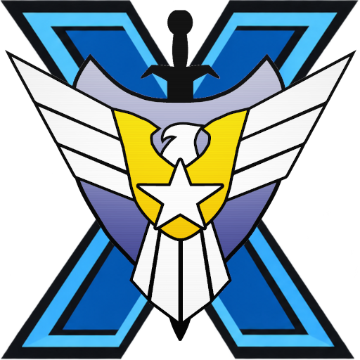

<p align="center">
  
</p>

<h1 align="center">GeneralsX</h1>

<p align="center">
  <strong>Play Command & Conquer: Generals & Zero Hour on macOS, Linux, and Windows — with native cross-platform online multiplayer.</strong>
</p>

<p align="center">
  <a href="https://deepwiki.com/fbraz3/GeneralsGameCode"></a>
  <a href="https://github.com/fbraz3/GeneralsX/actions/workflows/ci.yml"></a>
  <a href="https://github.com/fbraz3/GeneralsX/releases"></a>
  <a href="https://github.com/fbraz3/GeneralsX/wiki"></a>
</p>

---

**GeneralsX** lets you run **Command & Conquer: Generals** and **Zero Hour** natively on **macOS, Linux, and Windows**. Built on a modern open-source engine stack, it brings back smooth gameplay, seamless cross-platform online multiplayer, and full compatibility with original campaigns, mods, and replays on modern computers.

## ✨ Highlights

- 🌐 **Cross-Play Online Multiplayer**: Native online matchmaking and lobbies powered by **GeneralsOnline (NGMP)**. Play seamlessly across **macOS, Linux, and Windows** without GameSpy, Hamachi, or VLAN tools.
- 💻 **Native Modern Performance**: Runs natively on **macOS** (Apple Silicon), **Linux** (x86_64), and **Windows**. No legacy 32-bit baggage.
- 🌋 **Modern Graphics**: Replaces the ancient DirectX 8 backend with Vulkan translation via DXVK for smooth performance on modern monitors and GPUs.
- 🔊 **Updated Audio & Video**: Crystal-clear cross-platform audio (OpenAL / MiniAudio) and full video cinematics support via FFmpeg.
- 🎯 **100% Retail Compatibility**: Full support for original singleplayer campaigns, Skirmish vs AI, replays, and community mods.
- 📦 **Generals & Zero Hour**: Play both the base game and the expansion from a unified, modern codebase.

---

## 🚀 Getting Started

### Download & Play
Ready-to-run releases are available for macOS, Linux, and Windows:

* 📦 **[Download GeneralsX Releases](https://github.com/fbraz3/GeneralsX/releases)** – Pre-built packages for macOS, Linux, and Windows
* 📖 **[Installation & Game Data Setup Guide](https://github.com/fbraz3/GeneralsX/wiki)**

> *Note: GeneralsX is an engine recreation and requires original game data files from a legitimate copy of Command & Conquer: Generals / Zero Hour (The First Decade, EA App, Steam, or retail CDs).*

### 🌐 Cross-Platform Multiplayer
GeneralsX includes integrated multiplayer powered by **GeneralsOnline**. Players on macOS, Linux, and Windows can host, join lobbies, and battle against each other online with zero network configuration hurdles.

---

## 📱 Ecosystem & Community Ports

The flexibility and modern foundation of GeneralsX have enabled several community-driven ports across mobile and web platforms:

* **[Generals-Mac-iOS-iPad](https://github.com/ammaarreshi/Generals-Mac-iOS-iPad)** – iOS and iPadOS port by [@ammaarreshi](https://github.com/ammaarreshi)
* **[Generals-Android](https://github.com/fadi-labib/Generals-Android)** – Android port by [@fadi-labib](https://github.com/fadi-labib)
* **[wasm-generals](https://github.com/origami-ltd/wasm-generals)** – WebAssembly + WebGPU browser port by [@ebellumat](https://github.com/ebellumat) (playable at [generals.wasm.com.br](https://generals.wasm.com.br))

---

## 🛠️ Building from Source

GeneralsX uses CMake with predefined presets for supported platforms:

```bash
# macOS (Apple Silicon)
cmake --preset macos-vulkan
cmake --build build/macos-vulkan --target z_generals

# Linux (x86_64)
cmake --preset linux64-deploy
cmake --build build/linux64-deploy --target z_generals
```

For complete prerequisites, Docker workflows, and packaging guides, check the Wiki:
- 📖 [Building on macOS Guide](https://github.com/fbraz3/GeneralsX/wiki/Building-on-macOS)
- 📖 [Building on Linux Guide](https://github.com/fbraz3/GeneralsX/wiki/Building-on-Linux)

---

## 📜 Project Lineage & Credits

GeneralsX stands on the shoulders of the RTS community and open-source pioneers:

* **[Westwood Studios & EA](https://www.ea.com/)** for creating the Command & Conquer: Generals universe.
* **[TheSuperHackers](https://github.com/TheSuperHackers/GeneralsGameCode)** for foundational code modernization, stability fixes, and upstream preservation.
* **[Fighter19](https://github.com/Fighter19) & [feliwir](https://github.com/feliwir)** for early reference work pioneering SDL3, DXVK, and OpenAL in Zero Hour.

---

## 💖 Support & Contributing

- **[Sponsor on GitHub](https://github.com/sponsors/fbraz3)** – Help fund test hardware, server infrastructure, CI/CD pipelines, and active development.
- **[Contributing Guide](CONTRIBUTING.md)** – Contributions are welcome! Check our issues and pull request guidelines before opening a PR.

## 📄 License

See the [LICENSE](./LICENSE.md) file for details.  
*EA has not endorsed and does not support this product. Command & Conquer is a trademark of Electronic Arts Inc.*
