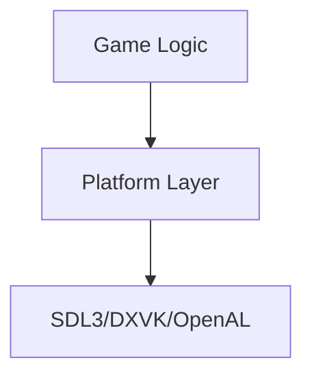

# TOPICS/ARCHITECTURE.md

## Summary

Architectural patterns — design principles and patterns used in GeneralsX.

---

## Key Principles

### Platform Isolation (RAG)

**Never call native platform APIs in game logic.**

**Why:**
- Enables cross-platform compatibility
- Simplifies testing
- Reduces platform-specific bugs

**How:**
- Use SDL3 for all platform I/O
- Feature flags for optional behavior
- Isolate platform code to `Core/GameEngineDevice/`

### Determinism

**Rendering/audio changes must not affect gameplay logic.**

**Why:**
- Ensures replay compatibility
- Maintains competitive integrity
- Enables reliable testing

**How:**
- Shared FPS cap code
- Deterministic math gateway
- Platform-specific frame pacing

---

## Architectural Patterns

### Layer Pattern



**Rules:**
- Game logic never touches platform APIs
- Platform layer handles all I/O
- Clear boundaries enforced

### Gateway Pattern

**Math Gateway:**
- `Sqrt(double)` in `trig.h`
- Routes through `WWMath` wrapper
- Ensures platform consistency

**FPS Gateway:**
- FramePacer API guard for Windows
- Platform-specific frame pacing
- Shared FPS cap validation

---

## Patterns in Practice

### Platform-Specific Code

**DO:**
```cpp
#ifdef __linux__
  // Linux-only code
#elif defined(__APPLE__)
  // macOS-only code
#else
  // Fallback or error
#endif
```

**DON'T:**
```cpp
// Direct X11 call
XInitThreads();
```

### Feature Flags

**DO:**
```cpp
#ifndef FEATURE_DXVK
#define FEATURE_DXVK 1
#endif
```

**DON'T:**
```cpp
// Hardcoded platform behavior
D3D8CreateDevice(...);
```

---

## See Also

- [ARCHITECTURE/LAYERS.md](../ARCHITECTURE/LAYERS.md) — Layer boundaries
- [ARCHITECTURE/FLOW.md](../ARCHITECTURE/FLOW.md) — System lifecycle
- [ARCHITECTURE/DATA.md](../ARCHITECTURE/DATA.md) — Data handling
- [CONCEPTS/RAG.md](../CONCEPTS/RAG.md) — Platform isolation
- [CONCEPTS/DETERMINISM.md](../CONCEPTS/DETERMINISM.md) — Determinism rules

---

**Last updated**: 2026-05-18 | **Sources**: AGENTS.md, architecture documentation
