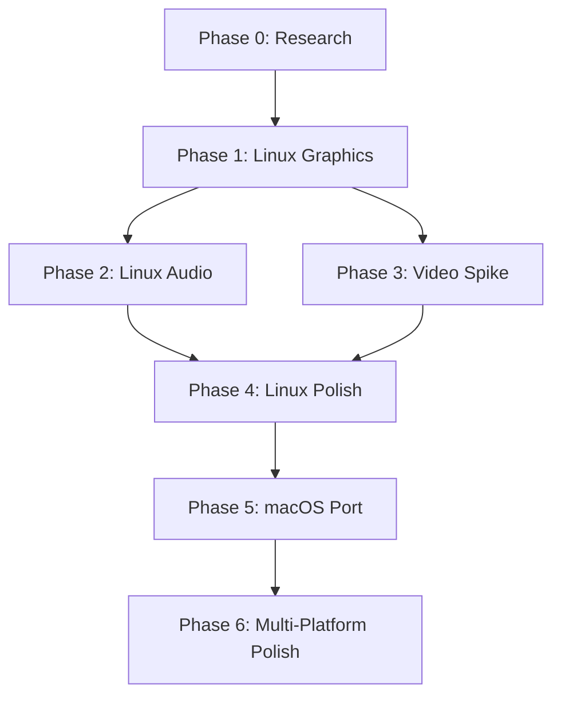

# GeneralsX Linux Port - Project Roadmap

**Last Updated**: 2026-02-08  
**Current Phase**: Phase 1 (Linux Graphics - 70% complete)

---

## Vision

Port Command & Conquer: Generals Zero Hour to run natively on Linux and macOS, while maintaining 100% Windows compatibility and retail replay compatibility.

---

## Platform Strategy

```
Windows (Baseline)
   ↓
   ├─→ Linux (Phase 1-4)    ← Primary focus
   │      ↓
   │      └─→ macOS (Phase 5) ← Natural extension (70-80% code reuse)
   │             ↓
   │             └─→ Multi-platform polish (Phase 6)
   │
   └─→ Windows VC6/Win32 (always maintained)
```

**Key insight**: Linux and macOS share SDL3, Vulkan (MoltenVK), and OpenAL. Once Linux works, macOS is relatively easy (~20-40 hours).

---

## Phase Overview

| Phase | Name | Status | Duration | Completion |
|-------|------|--------|----------|------------|
| 0 | Analysis & Planning | ✅ Complete | 2 weeks | 100% |
| 1 | Linux Graphics (DXVK+SDL3) | 🚧 In Progress | 4 weeks | 70% |
| 2 | Linux Audio (OpenAL) | 📋 Not Started | 4 weeks | 0% |
| 3 | Video Playback (Spike) | 📋 Not Started | 2-4 weeks | 0% |
| 4 | Polish & Hardening (Linux) | 📋 Not Started | 10 weeks | 0% |
| 5 | **macOS Port (MoltenVK)** | 📋 Not Started | 1-2 weeks | 0% |
| 6 | Multi-Platform Polish | 📋 Future | 4-6 weeks | 0% |
| 7+ | Multiplayer, Mods, etc. | 📋 Future | TBD | 0% |

**Total estimated time to macOS release**: ~6-8 months (Phase 0-5)

---

## Detailed Phase Breakdown

### ✅ Phase 0: Analysis & Planning (COMPLETE)

**Duration**: 2 weeks (2026-02-07)  
**Goal**: Deep research before implementation

**Deliverables**:
- [x] Current renderer architecture documented
- [x] fighter19 DXVK patterns analyzed
- [x] jmarshall OpenAL patterns analyzed
- [x] Platform abstraction layer designed
- [x] Docker build workflow configured
- [x] Phase 1 implementation plan created

**Reference Documents**:
- `docs/WORKDIR/phases/PHASE00_ANALYSIS_PLANNING.md`
- `docs/WORKDIR/support/phase0-*.md` (5 research docs)

---

### 🚧 Phase 1: Linux Graphics - DXVK + SDL3 (70% COMPLETE)

**Duration**: 4 weeks (Started 2026-02-07, ~70% done)  
**Goal**: Native Linux rendering via Vulkan/DXVK

**Completed**:
- [x] DXVK loader integration (`dx8wrapper.cpp`)
- [x] CMake preset (`linux64-deploy`)
- [x] SDL3 device layer (~450 lines real code)
- [x] OpenAL audio manager (~550 lines real code)
- [x] CMakeLists.txt integration (source files added)
- [x] Documentation consolidated

**Remaining**:
- [ ] First Docker build test (compile + fix errors)
- [ ] Smoke test (launch + verify initialization)
- [ ] Fix missing headers/symbols
- [ ] Filesystem case sensitivity (deferred to Phase 2?)

**Acceptance Criteria**:
- Linux binary launches and shows main menu with graphics
- Basic gameplay (skirmish) runs without crashes
- Windows builds (VC6/Win32) still work

**Reference Document**: `docs/WORKDIR/phases/PHASE01_IMPLEMENTATION_PLAN.md`

---

### 📋 Phase 2: Linux Audio - OpenAL Integration (NOT STARTED)

**Duration**: 4 weeks (After Phase 1 complete)  
**Goal**: Wire OpenAL backend to game audio system

**Scope**:
- Audio event tracking (handle lifecycle)
- Sound effects playback (gunshots, explosions, unit voices)
- Music streaming (background tracks)
- 3D audio positioning (listener + source positions)
- Buffer management and caching

**Acceptance Criteria**:
- Menu music plays on Linux
- Sound effects work (3D positioned)
- Music tracks advance correctly
- No audio crashes or leaks

**Reference Document**: `docs/WORKDIR/phases/PHASE02_LINUX_AUDIO.md`

---

### 📋 Phase 3: Video Playback - Bink Alternative (SPIKE)

**Type**: Research spike (outcome uncertain)  
**Duration**: 2-4 weeks (or 1 week if stubbed)  
**Goal**: Investigate video codec alternatives

**Options**:
1. FFmpeg-based player (implement)
2. Stub out videos (skip gracefully)
3. Defer indefinitely (lowest priority)

**Acceptance Criteria** (one of three outcomes):
- Videos play via FFmpeg OR
- Game skips videos gracefully OR
- Defer with clear rationale documented

**Reference Document**: `docs/WORKDIR/phases/PHASE03_VIDEO_PLAYBACK.md`

---

### 📋 Phase 4: Polish & Hardening - Linux (NOT STARTED)

**Duration**: 10 weeks (After Phase 1-3)  
**Goal**: Production-ready Linux port

**Scope**:
- Bug bash (smoke tests, stress tests)
- Performance profiling (target: <15% overhead vs Windows)
- Multi-distro testing (Ubuntu, Fedora, Arch, Steam Deck)
- Packaging (AppImage, Flatpak)
- Documentation (INSTALL_LINUX.md, TROUBLESHOOTING_LINUX.md)
- Community beta testing

**Acceptance Criteria**:
- No P0 crashes
- <10% FPS difference vs Windows
- Works on 4+ Linux distros
- AppImage released
- >10 beta testers, feedback incorporated

**Reference Document**: `docs/WORKDIR/phases/PHASE04_POLISH_HARDENING.md`

---

### 📋 Phase 5: macOS Port - MoltenVK (NOT STARTED) ⭐ NEW

**Duration**: 1-2 weeks (~20-40 hours)  
**Goal**: Port Linux build to macOS using MoltenVK

**Why Easy?**:
- ✅ SDL3 cross-platform (same API)
- ✅ Vulkan API identical (MoltenVK implements Vulkan 1.1+)
- ✅ OpenAL cross-platform (same API)
- ✅ DXVK should compile for macOS (minor changes)
- ✅ **70-80% code reuse from Linux**

**Scope**:
- CMake preset for macOS (`macos-vulkan`)
- Adapt library loading (`.so` → `.dylib`)
- MoltenVK integration
- Universal binary (Intel + Apple Silicon)
- Basic testing + packaging (.app bundle)

**Acceptance Criteria**:
- macOS binary launches and shows main menu
- Skirmish playable (graphics + audio + input)
- Performance within 20% of Linux (~80 FPS)
- .app bundle or .dmg installer

**Performance Expectations**:
```
Windows (DX8)      → 100 FPS (baseline)
Linux (DXVK)       →  90 FPS (10% overhead)
macOS (MoltenVK)   →  85 FPS (15% overhead)
```

**Reference Document**: `docs/WORKDIR/phases/PHASE05_MACOS_PORT.md`

---

### 📋 Phase 6: Multi-Platform Polish (FUTURE)

**Duration**: 4-6 weeks (After Phase 5)  
**Goal**: Unified cross-platform experience

**Scope**:
- Cross-platform bug fixes (Windows + Linux + macOS)
- Performance parity (all platforms within 10% of baseline)
- Unified packaging (releases for all platforms)
- Cross-platform testing (verify consistency)
- Documentation consolidation

**Acceptance Criteria**:
- All platforms have <10 P1 bugs
- Performance within 10% across platforms
- Unified release process (GitHub Actions?)
- Community-tested on all platforms

---

### 📋 Phase 7+: Future Enhancements (FUTURE)

**Not scheduled, community-driven**:
- Multiplayer/network testing
- Mod compatibility (Zero Hour mods, map packs)
- Steam Deck optimizations
- Native Metal renderer (macOS optimization, optional)
- Wayland support (Linux)
- High DPI scaling
- Localization
- Steam integration

---

## Key Milestones

| Milestone | Target Date | Description |
|-----------|-------------|-------------|
| Phase 1 Complete | 2026-02-15 | Linux graphics working (menu + gameplay) |
| Phase 2 Complete | 2026-03-15 | Linux audio working (SFX + music) |
| Phase 4 Complete | 2026-06-01 | Linux production-ready (community beta) |
| **macOS Alpha** | **2026-06-15** | **macOS port working (Phase 5 complete)** |
| Phase 6 Complete | 2026-08-01 | All platforms polished (1.0 release?) |

---

## Dependencies & Blockers



**Critical Path**: Phase 1 → Phase 2 → Phase 4 → Phase 5  
**Optional**: Phase 3 (videos can be deferred)

---

## Platform Support Matrix

| Platform | Rendering | Audio | Status | Target Release |
|----------|-----------|-------|--------|----------------|
| Windows (VC6) | DirectX 8 | Miles Sound System | ✅ Maintained | Baseline |
| Windows (Win32) | DirectX 8 | Miles Sound System | ✅ Maintained | Experimental |
| Linux | DXVK (Vulkan) | OpenAL | 🚧 Phase 1-4 | v1.0 (2026-06) |
| macOS | MoltenVK (Vulkan) | OpenAL | 📋 Phase 5 | v1.1 (2026-06) |
| Steam Deck | DXVK (Vulkan) | OpenAL | 📋 Phase 6 | v1.2 (2026-08) |

---

## Technology Stack

### Cross-Platform (Linux + macOS)
- **Windowing**: SDL3 (replaces Win32 API)
- **Rendering**: Vulkan via DXVK (DirectX 8 → Vulkan translation)
  - Linux: dxvk-native + system Vulkan loader
  - macOS: dxvk-native + MoltenVK (Vulkan → Metal)
- **Audio**: OpenAL (replaces Miles Sound System)
- **Build**: CMake + Ninja, Docker for Linux cross-compilation

### Windows (Preserved)
- **Windowing**: Win32 API
- **Rendering**: DirectX 8 (native)
- **Audio**: Miles Sound System (native)
- **Build**: VC6 (retail compatible) or Win32 (MSVC 2022)

---

## Success Metrics

### Phase 1-4 (Linux)
- ✅ Compiles and launches on Ubuntu 22.04+
- ✅ Replays compatible with Windows builds (determinism preserved)
- ✅ Performance within 15% of Windows (acceptable for community port)
- ✅ Community feedback positive (>80% satisfaction)

### Phase 5 (macOS)
- ✅ Compiles and launches on macOS 11.0+
- ✅ Universal binary (Intel + Apple Silicon)
- ✅ Performance within 20% of Windows (85+ FPS)
- ✅ <20 hours effort (proof of code reusability)

### Phase 6 (Multi-Platform)
- ✅ All platforms have <10 P1 bugs
- ✅ Unified release process (one tag, three packages)
- ✅ Cross-platform multiplayer works (if implemented)

---

## Community Engagement

### Linux Beta (Phase 4)
- Target: >10 beta testers
- Channels: GitHub Releases, Discord, Reddit (/r/commandandconquer)
- Feedback: Bug reports, performance, compatibility

### macOS Alpha (Phase 5)
- Target: >5 alpha testers
- Gauge demand: "Would you use native macOS build over Wine/CrossOver?"
- Decision: If low demand (<50% interest), defer to future

### 1.0 Release (Phase 6)
- All platforms production-ready
- Community-tested (>50 users across all platforms)
- Clear documentation (installation, troubleshooting, building)

---

## Risk Mitigation

| Risk | Impact | Mitigation | Status |
|------|--------|------------|--------|
| Phase 1 DXVK issues | High | fighter19 reference working, expect similar results | Monitoring |
| Phase 2 OpenAL complexity | Medium | jmarshall reference provides patterns | Monitoring |
| Phase 3 Video licensing | Low | Can defer indefinitely, not essential | Accepted |
| Phase 5 DXVK macOS build | Medium | Check early, may need patches | To investigate |
| Phase 5 MoltenVK quirks | Low | MoltenVK is mature, expect smooth | Low risk |

---

## Notes

- **Linux first, macOS second**: Don't compromise Linux stability for macOS features
- **Windows always maintained**: VC6 builds must continue to work (replay compatibility)
- **Code reusability is key**: Design decisions favor cross-platform patterns
- **Community-driven priorities**: If macOS demand is low, defer to future or skip
- **Performance is acceptable**: 10-20% overhead is fine for community port
- **macOS updated insight**: MoltenVK is mature, macOS port is viable and relatively easy

---

## References

- **Phase Documents**: `docs/WORKDIR/phases/PHASE*.md`
- **Research**: `docs/WORKDIR/support/`
- **Dev Blog**: `docs/DEV_BLOG/2026-02-DIARY.md`
- **Instructions**: `.github/instructions/generalsx.instructions.md`
